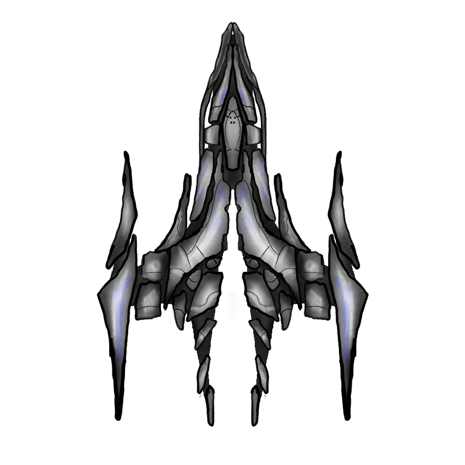
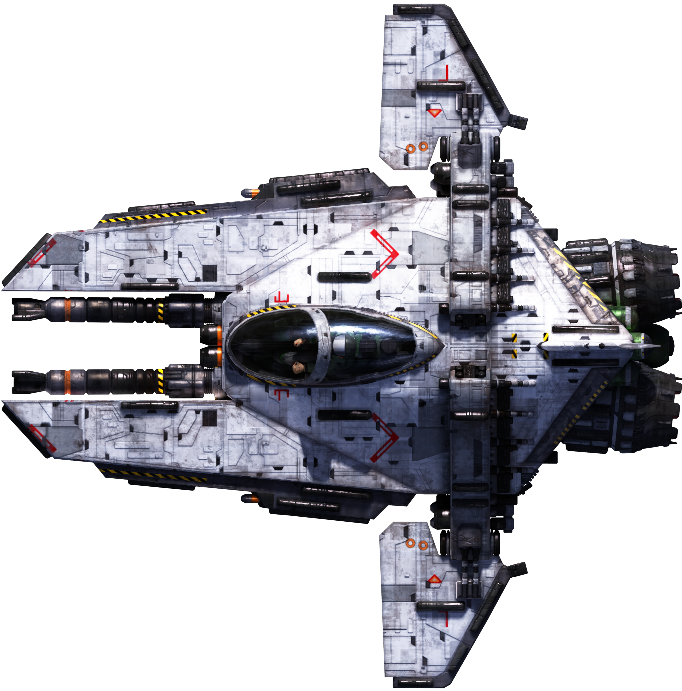
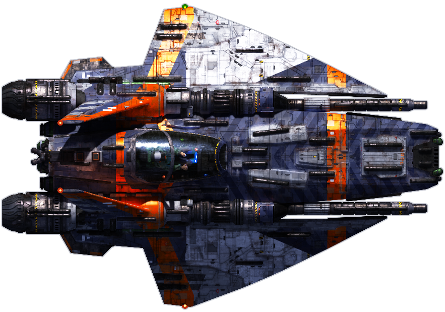
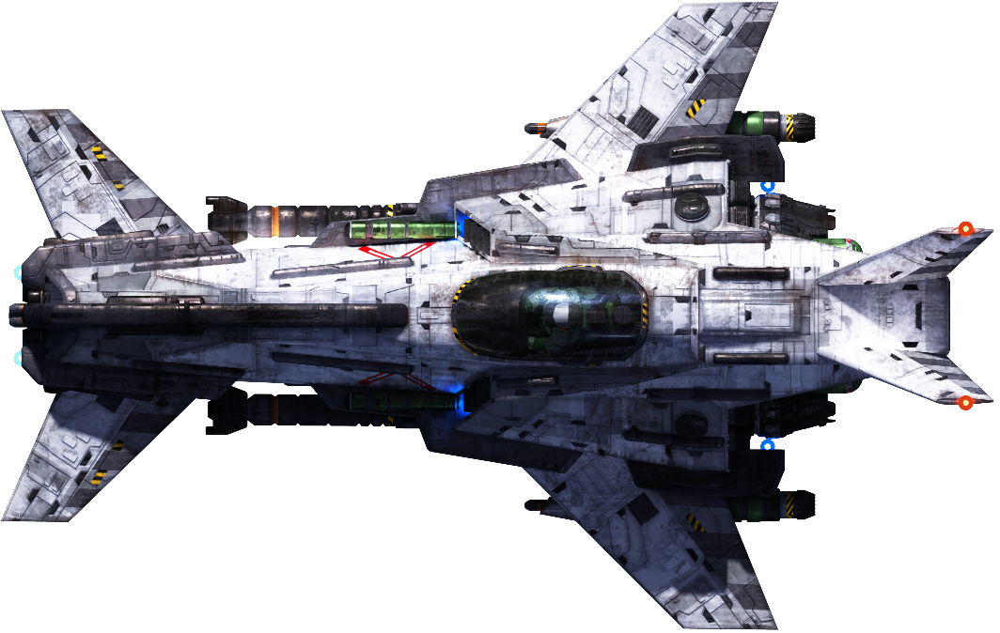
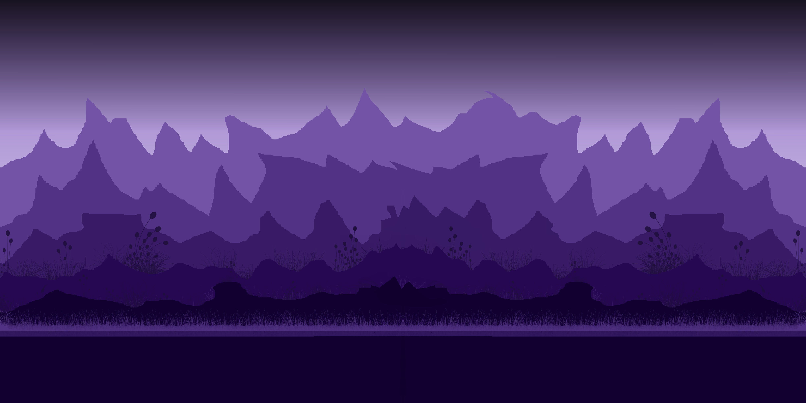
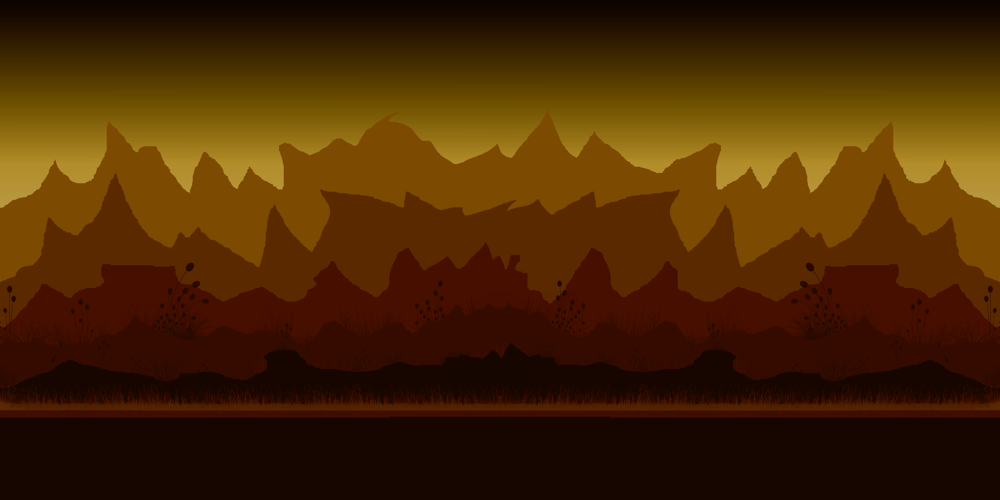
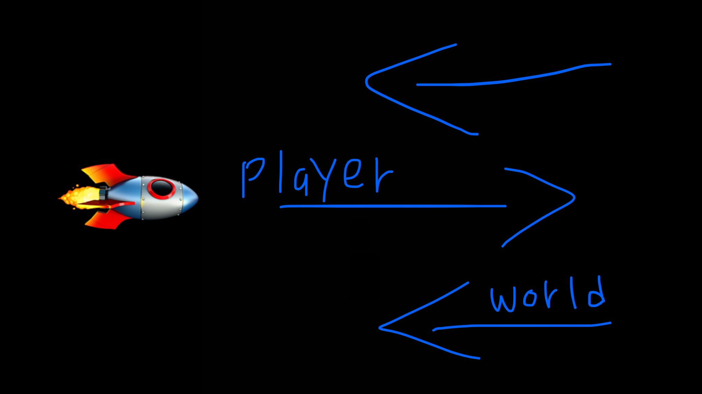

# Space-Shooters 🚀

This game pitch document contains the comprehensive description of the final game project development using the skills learned throughout the program. The game is built on **C++ programming** language and **SFML (Simple and Fast Multimedia Library)** API. SFML is a cross-platform software development library designed to provide a simple application programming interface to various multimedia components in computers.

## 1. Executive Summary 📇

The space shooter is a 2D shooting game with little animations and graphics. The main character will be a spaceship which is controllable by player. The map looks similar as a dark space and player will experience like real space war. There will be enemies, final boss, pickups, health, score, menus, unique bullets, missiles. The game has different levels, and the difficulty of the game is based on the level up of game. The player spaceship has different animations that will make game more fun and interactive. The player spaceship has different levels of bullets, the bullets will be upgraded when level up or by pickups.

The game has different menu state. The player can pause/resume the game whenever wants or also quit the game. The game has music theme which make game more interesting and fun to play. Moreover, the bullets also have some animation that made game look cool. As mentioned above, the bullets will be upgraded as levels upgrades and it will bring more fun to the gameplay. For the main character, player can adjust 3 or 4 types of theme of the spaceship animation. There will be health for the player, enemies and final boss. Player has to be beat enemies to meet final boss and have to defend obstacles for killing the final boss. The player will win after killing final boss and will upgraded to next round.

Overall, the space shooter game will bring fun and interest in gameplay.

    - Language: C++
    - API: SFML (Simple and Fast Multimedia Library)
    - Tool: Visual Studio 2019

## 2. Game Description 📋

## _A. Overview_ 📜

• The big picture of the game is to defend the spaceship from the different enemies and defend the final boss to win the game. The spaceship introduced with different types of pickups during the mission. The pickups will be not generated randomly, spaceship has to kill some enemies in order to generate some pickups. The pickups generally boost speed, upgrades the bullet type and increases health of the player spaceship. The Player have to keep their health safe (stay alive) to survive till the end.

• The main quest of the game is to defend enemies and kill the final boss to win the game and exceed to the next level. The failure of doing that will bring you to the first level of the game. If a player ended having 0% of health, or killed by enemy, the result will be the same.

• The main players of the space shooter will be Spaceship (player), little space shuttles (enemy), final boss.

---

## _B. The Quest_ 🎯

• The spaceship is lost in space by mistake, and it has to be survived and go to his destiny by defending some enemies and boss. The spaceship has different kinds of abilities that could be useful to stay alive and fight with boss.

• The space is not empty, obstacles like some broken asteroid that are coming on the way of spaceship. Also, alien’s spaceship is also there to kill player. The player spaceship get a chance to take some pickups to boost speed, bullet upgrade and many more. Player has to kill enemies to generate pickups.

• The final objective is powerful boss that will come to the end of the level. The player spaceship needs more advanced bullets and missiles to kill the boss. Every level has a final boss.

• The game is broken into different levels. The player spaceship has to kill enemies and boss to proceed next level of the game. If failed, it will bring you to first level of game.

---

## _C. Main Character_ 🤖

The main character is a spaceship having different launch paddles of bullets. The main character have bullets as well as missiles. The main character also have shield to protect it self from enemy bullets and missiles. The speed of spaceship is normal, there is no such power that boost up the speed of the spaceship. The spaceship Avtar will change as it reaches to different levels gradually. The space-shooter game is third-person game.

---

## _D. Sketch of Main Character_ 🎨

This is main character of space-shooter game. It is in .png form so background will be ignored automatically. The main character Avtar is very dark, scary and looks like violent spaceship.

---

## _E. Opponents_ 💀

There will be many opponents in the game, first will be small ships that can damage the main character spaceship in certain amount. Second opponent will be aliens’ ships that also could damage average amount of damage on main character spaceship. Last one is main boss of the level, that can damage hugely on main character spaceship.

• The small ships are programmed to follow the main character spaceship and damage it. It will happen if the main character spaceship will enter these small ship’s allocated boundary to follow main character spaceship.

• The aliens ship just can shoot bullets towards the main character spaceship. If alien’s spaceship and main character ship get crashed with each-other, it will impact on main character spaceship health dramatically.

• The main character can avoid the small ships and aliens’ ships by moving further of their programmed boundary.

• The main opponent is the final boss of the level, it can damage more and hard to kill it. Enemy boss also can shoot missile towards the main character ship.

---

## _F. Sketch of opponents_ 🎨

Primary opponents

    1.	Small ships

    2.	Alien’s ship

    3.	Final Boss

(NOTE: The enemy and main character sketch could be change)

---

## _G. Environment_ ✨

The space-shooter game is based on space map. The map is dark, colored, and somehow scary. There will be some mountains which have different colors. The map will be 2-dimentioned with some textures. The gameplay experience will be same as a space war. Overall, the space-shooter game is an outer space environment game.

Below is some textures of the mountains that will be present on the space map.

---

## _H. Sketch of the world_ 🎨

The space-shooter game behavior is side-scroller. The screen will follow player spaceship as it moves right side.
So, the action is from left to right.

For Example,

---

## _I. Menus_ ◯‍

The game has one menu for quitting, starting, and pausing the game. The game will be paused on the current state when player pauses the game. The application will quit when player press quit game option.

---

## _J. Controls_ 🕹️

There are many certain key controls for controlling the player spaceship and game behavior.

**W | UP** – upside of the map

**S | DOWN** – downside of the map

**D | Right** – right side of the map (in side-scroll game case, it refers to forward.)

**A | LEFT** – left side of the map (in side-scroll game case, it refers to backward)

---

## _K. Sounds_ 🎵

The space-shooter game has different sounds for different events.
Introduction background music – it plays when the game is launch and when the game is paused.

**_Gameplay music_** – this music continuously plays during the gameplay. If player quits or pause the music will stop.

**_Bullet sound_** – the bullets will have sounds

**_Missile sound_** – the missile has their own sound

**_Crashed sound_** – if the player spaceship crashes, sound will be played

---

## _3. Summary_ 📇

The space-shooter game is a 2D shooting game in space and the main story is the player spaceship fights with certain aliens, enemies, and boss to reach its safe home back.

The space-shooters game is likely to be resulted as more fun in general. Although, there is little graphics and animations in the game, it is effectively differentiating from other recent space-based game. Moreover, anyone can play this game if they are above 10+ years. This game is user friendly and easy to play. Space-shooters can be played on worlds most used operating system – windows. The game will surely fulfil user’s expectations such as short-term fun during work or anything else.

The game will have updates at certain amount of time for optimization and new map, new character, new enemies, more animations, graphics and many more. The game will be more and more fun gradually.

**Thank you!** ❤️
